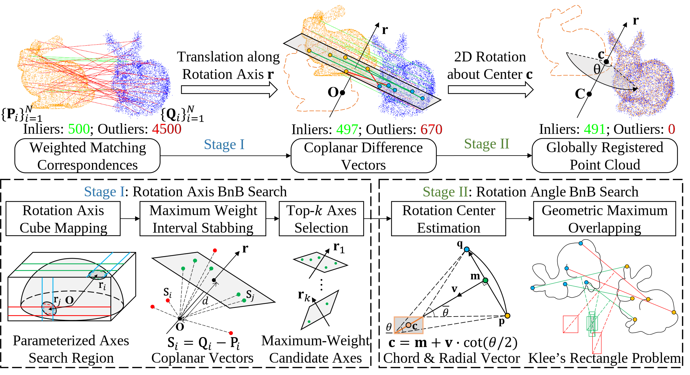

# GMOR

## Introduction

This repository contains the C++ implementation of following algorithms:

- Official implementation of "[Robust Point Cloud Registration via Geometric Overlapping Guided Rotation Search](https://arxiv.org/abs/2508.17427)" (Under review)
- Unofficial implementation of reproduced TR-DE: "Deterministic Point Cloud Registration via Novel Transformation Decomposition" (Wen Chen *et al*., CVPR 2022)

The framework of GMOR is as following:



## News

- 2026.01: Add more comparative experiments and release source code. Submitted.
- 2025.11: Rejected.
- 2025.08: Upload to ArXiv and submitted.

## Build

This project can be built on both Linux and Windows with following dependencies:

- PCL >= 1.12.1
- nanoflann >=1.4.2
- Eigen >= 3.4.0
- OpenMP
- glog
- gflags

### Linux

Install the dependencies on Ubuntu 22.04:

```bash
sudo apt install build-essential cmake libpcl-dev libnanoflann-dev libeigen3-dev libomp-dev libgoogle-glog-dev libgflags-dev
```

Clone this repository and build the project:

```bash
mkdir build && cd build
cmake ..
cmake --build .
```

### Windows

Install the dependencies by vcpkg in PowerShell:

```bash
git clone https://github.com/microsoft/vcpkg.git
cd vcpkg
.\bootstrap-vcpkg.bat
vcpkg install pcl nanoflann eigen3 glog gflags
```

Clone and build:

```bash
mkdir build && cd build
# This environment variable `VCPKG_ROOT` is path to vcpkg
cmake -DCMAKE_TOOLCHAIN_FILE=$env:VCPKG_ROOT/scripts/buildsystems/vcpkg.cmake ..
cmake --build . --config Release
```

## Demo

We provide an entire pipeline for point cloud reading and preprocessing, feature extraction and matching, and global registration. Here is a simple example to register two 3DMatch point clouds in the `data` directory and print the infomation:

```bash
# Linux
./RegistrationFactory_demo --alsologtostderr
```

The transformation matrix will be written to `Rt.txt` in the current directory.

### Advanced options

Run `./RegistrationFactory_demo --help` for basic usage of the pipeline.

The options in basic usage are categorized below:

- Basic I/O options:
  - `--src`: Source point cloud file path (Supported formats: *\*.ply*, *\*.pcd*, *\*.bin*, *\*.csv*)
  - `--tgt`: Target point cloud file path
  - `--sim`: Enable it to use simulated data of `src`
  - `--exp`: Enable it to reproduce the results of our paper on 3DMatch/3DLoMatch/KITTI datasets
  - `--path`: 3DMatch/3DLoMatch/KITTI dataset path
- Preprocessing point clouds:
  - `--voxel_size`: Leaf size for voxel downsampling 
  - `--random_sample`: Enable this option to randomly sample `num_samples` points in real data.
  - `--num_samples`: Random sample number of points in simulated data; also used in real data if `random_sample` is enabled.
  - `--outlier_ratio`: Ratio of generated outliers in simulation.
  - `--icp_refine`: Post processing with ICP only for demo data to construct a coarse-to-fine pipeline. It is always disabled on datasets for reprodutibility and fair comparison with other global registration methods.
- Feature extraction and matching:
  - `--radius_normal`: Radius for normal estimation, and the view point is origin by default
  - `--radius_feature`: Radius for FPFH feature extraction
  - `--knn`: Number of nearest neighbors for reweighting in feature space
  - `--df`: Distance factor for softmax reweighting
- Global registration:
  - `--reg`: Registration method, GMOR or TRDE
  - `--noise_bound`: Threshold of inliers distance; also used in simulated data for adding noises
  - `--topk`: Number of rotation axes to be selected in stage I
  - `--rot_near_z`: Enable it to accelerate the BnB search with rotation axes near z-axis for convenience of registering points that are from LiDAR scanning on the ground

For example, a pair from KITTI dataset can be registered by the pipeline with the following command:

```bash
./RegistrationFactory_demo --alsologtostderr \
    --src=../data/000000.bin \
    --tgt=../data/000014.bin \
    --rot_near_z=true \
    --topk=1 \
    --knn=10 \
    --df=0.05 \
    --voxel_size=0.30 \
    --random_sample=true \
    --num_samples=8000 \
    --noise_bound=0.60 \
    --radius_normal=0.90 \
    --radius_feature=2.40
```

The options above are searching the rotation axes near z-axis, selecting top `1` rotation axis, using `10` nearest neighbors for reweighting in feature space, setting the distance factor of softmax reweighting to `0.05`, downsampling the point clouds by `0.30` voxel size and then ramdomly sampling `8000` points, setting the inliers threshold to `0.60`, estimating the normals with radius of `0.90`, and estimating the FPFH features with radius of `2.40`. These parameters can be adjusted to achieve better performance on your own data.

!!! Note Normal estimation from non-sensor coordinate system
    If point cloud is not in the original coordinate system of 3D sensors, the viewpoint of normal estimation should be move away from the points to ensure the consistency of normals. Otherwise, the FPFH features might be incorrect.
    Besides, if the input point clouds are with normals (e.g. mesh input), `computeFPFHwithNormals` function in `exp_utils.h` can be used.

Furthermore, we also provide the `solve2D` function in `gmor.h` for 2D rigid registration (e.g. LiDAR correspondences with equal z-coordinates, bird's eye view correspondences).

## Datasets

Enable the option `--exp=true` to reproduce the results of our paper on 3DMatch/3DLoMatch/KITTI datasets.

### 3DMatch/3DLoMatch

#### FPFH

We provide an entire pipeline for processing the raw point clouds of 3DMatch/3DLoMatch datasets using FPFH:

1. Download the original point clouds from the "Geometric Registration Benchmark" of [3DMatch official website](https://3dmatch.cs.princeton.edu).
2. The dataset directory is organized as follows:
```
Dataset
├── 7-scenes-redkitchen
│   ├── cloud_bin_0.ply
│   ├── cloud_bin_1.ply
│   ├── ...
│   └── cloud_bin_59.ply
├── sun3d-home_at-home_at_scan1_2013_jan_1
├── ...
└── sun3d-mit_lab_hj-lab_hj_tea_nov_2_2012_scan1_erika
```
3. Download the 3DMatch/3DLoMatch benchmarks from [OverlapPredator/configs/benchmarks](https://github.com/prs-eth/OverlapPredator/tree/main/configs/benchmarks) and copy them to the `benchmarks` directory.
4. In `build` directory, run `../scripts/test_3DMatch.sh --path=/path/to/your/Dataset --datatype=3DMatch` to reproduce the results of our paper, and the results will be saved as `result_3DMatch.csv` in current working directory. The `datatype` can be set to `3DLoMatch` as well.

#### Preprocessed features

The learning-based feature descriptors can be extracted by the pre-trained models following [FCGF](https://github.com/chrischoy/FCGF) and [OverlapPredator](https://github.com/prs-eth/OverlapPredator). Save them as `*.csv` format, e.g. `cloud_bin_0_fcgf_points.csv` and `cloud_bin_0_fcgf_features.csv`.

For Predator that is extracted with pairwise input, the file name should be organized as `src_0_predator_points.csv`, `tgt_0_predator_points.csv`, `src_0_predator_features.csv`, `tgt_0_predator_features.csv`, `src_0_saliency_score.csv`, and `tgt_0_saliency_score.csv`, where `saliency_score = overlap * saliency` following `benchmark_predator` function in the official implementation. Note that the voxel size of Predator is 2.5cm, the `noise_bound` in our project is set to twice the voxel size (`0.05`).

Run the shell scripts in `build` directory (e.g. FCGF):

```bash
cd build
../scripts/test_3DMatch_FCGF.sh --path=/path/to/your/Dataset
```

### KITTI

#### FPFH

We also provide an entire pipeline for processing the raw point clouds of KITTI dataset using FPFH, which contains: (1) Voxel downsampling; (2) ICP-based ground truth refinement with initial calibration and camera poses (Following `KITTIPairDataset` class in [FCGF/lib/data_loaders.py](https://github.com/chrischoy/FCGF/blob/master/lib/data_loaders.py) that reduces drift error but implemented with PCL); (3) Normal estimation and FPFH extraction; (4) Random sampling and global registration.

The indices of KITTI 555 pairs generated by [FCGF](https://github.com/chrischoy/FCGF) project are in `benchmarks/KITTI/pairs.csv`, and they can be evaluated as follows:

1. Download the velodyne laser odometry dataset, calibration files and ground truth poses from [KITTI official website](https://www.cvlibs.net/datasets/kitti/eval_odometry.php).
2. The dataset directory is organized as follows:
```
Dataset
├── poses
│   ├── 00.txt
│   ├── 01.txt
│   ├── ...
│   └── 10.txt
└── sequences
    ├── 00
    │   ├── velodyne
    │   ├── calib.txt
    │   └── times.txt
    ├── 01
    ├── ...
    └── 21
```
3. In `build` directory, run `../scripts/test_KITTI.sh -path=/path/to/your/Dataset` to reproduce the results saved as `result_KITTI.csv`. The refined ground truth poses, which reduce the drift error, will be saved in `/path/to/your/Dataset/icp_gt` directory for reusing.

#### FCGF

Download the pretrained [FCGF](https://github.com/chrischoy/FCGF) model with 0.30 m voxel size and 32 dimensions feature, where normalized (`conv1_kernel_size=7`) and unnormalized (`conv1_kernel_size=5`) features return the same recall in our method. And set `shuffle=False` in the `make_data_loader` function of `FCGF/test_kitti.py` to ensure the order of pairs.

Similarly, run `../scripts/test_KITTI.sh --path=/path/to/your/Dataset --feature=FCGF` in `build` directory to reproduce the results.

## Citation

If you find this project useful in your work, please consider citing:

```
@misc{zheng2025,
  title={GMOR: A Lightweight Robust Point Cloud Registration Framework via Geometric Maximum Overlapping},
  author={Zheng, Zhao and Fan, Jingfan and Shao, Long and Song, Hong and Ai, Danni and Fu, Tianyu and Xiao, Deqiang and Wang, Yongtian and Yang, Jian},
  publisher = {arXiv},
  year={2025}
}
```

## Acknowledgements

- [3DMatch](https://3dmatch.cs.princeton.edu)
- [KITTI](http://www.cvlibs.net/datasets/kitti)
- [FCGF](https://github.com/chrischoy/FCGF)
- [OverlapPredator](https://github.com/prs-eth/OverlapPredator)
- [HERE](https://github.com/tyhuang98/HERE-release)
